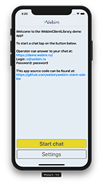
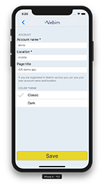
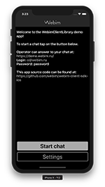
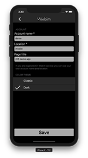

<center>


</center>

# WebimClientLibrary

This library provides [_Webim SDK_ for _iOS_](https://webim.ru/integration/mobile-sdk/ios-sdk-howto/) – a way to integrate _Webim_ service into your _iOS_ app.

## Installation

> Minimum iOS version supported – 8.0.

### CocoaPods

Add following line for your target in your **Podfile**:
```
pod 'WebimClientLibrary'
```
`use_frameworks!` must be specified.

### Carthage

Add following line to your **Cartfile**:
```
github "webim/webim-client-sdk-ios" ~> 3.18.1
```

### Additional notes

#### Objective-C

Trying to integrate _WebimClientLibrary_ into your _Objective-C_ code? Try out our [_WebimClientLibraryWrapper_](https://github.com/webim/webim-client-sdk-ios-wrapper).

#### Previous version

Previous _Objective-C_ version (version numbers 2.x.x) can be reached from **version2** branch.

## Release notes
* Not enough bits to represent a signed value in 32-bits platforms error fixed.

## Example

    

    

If you don't have _CocoaPods_ installed you should firstly run `sudo gem install cocoapods`.

To run the example project, clone the repo and run `pod install` from the **Example** directory first.

## Usage

### Session

SDK functionality usage starts with session object creating.

`Webim` class method `newSessionBuilder()` returns session builder object (class `SessionBuilder`) (both of this classes and their methods are described inside **Webim.swift** file). Then setting session parameters methods are to be called on the created `SessionBuilder` object. After all necessary parameters are set, method `build()` is to be called. This method returns `WebimSession` object.

Typical usage example:
```
let webimSession = try Webim.newSessionBuilder().set(accountName: "ACCOUNT_NAME").set(location: "LOCATION_NAME").build()
```

All parameters that can be set while creating a session and all errors that can be thrown are also described in **Webim.swift** file. Account name and locations are the only required of them.

After the session is created it must be started by `resume()` method (since a session object is initially paused).

Session can be paused (`pause()` method) and resumed (`resume()` method) as well as destroyed (`destroy()` method) if necessary. All of this methods are described in **WebimSession.swift** file.

### MessageStream

All message stream methods are described in **MessageStream.swift** file.

For this methods usage ability the `MessageStream` object is have to be getted through `getStream()` method by `WebimSession` class object.

Methods examples:
`send(message:)` – send message,
`rateOperatorWith(id:byRating:)` – rate operator,
`closeChat()` – close chat.

### MessageTracker

`newMessageTracker(messageListener:)`  method by `MessageStream` object creates `MessageTracker` object, which can be used to control a message stream inside an app.

E.g. `getNextMessages(byLimit:completion:)` method requests a certain amount of messages from the history.

Methods descriptions can be found inside **MessageTracker.swift** file.

### MessageListener

`MessageListener` protocol describes methods which can help to track changes in the message stream. An app must have a class which implements this protocol methods: `added(message:after:)`, `removed(message:)`, `removedAllMessages()`, `changed(message:to:)`. This methods are called automatically when new message is added, a message is deleted, all messages are deleted and a message is changed respectively.

Full methods descriptions can be found inside **MessageListener.swift** file.

### Message

`MessageListener` protocol methods operate on `Message` objects which is described inside **Message.swift** file.

All necessary information about specific message can be getted through  `Message` objects methods: unique message number (`getID()` method), message text (`getText()` method), attached file info (`getAttachment()` method) etc.

All related tools (methods for working with attachments, message types etc.) are also described in **Message.swift** file.

### Additional features

Methods for getting information about specific operator are described inside **Operator.swift** file. Operator object can be getted through `MessageStream` object `getCurrentOperator()` method.

Methods for working with remote notifications by _Webim_ service are described inside **WebimRemoteNotification.swift** file.

Specific remote notification object can be getted through `Webim` class `parse(remoteNotification:)` method. This class also has method `isWebim(remoteNotification:)` which can be used to easily discover whether the notification is send by _Webim_ service or not.

**FatalErrorHandler.swift** contains `FatalErrorHandler` protocol description. Its methods can be implemented by an app for tracking errors which can arise in progress. All kinds of specific errors are described inside the same file.

**MessageStream.swift** also contains additional protocols descriptions which can be implemented by an app classes for tracking different particular changes. E.g. `ChatStateListener` protocol methods are called when chat state is changed (all the specific chat states are described in the same file).

## Remote notifications

**For remote notifications to be enabled you should send your app certificates/private key to us. For more information please contact to our support!**

For iOS to be able to handle remote notifications automatically your app must be aware of possible remote notification types and arguments.

Possible `loc-key` values:
* `P.CR` means that operator sent contact information request.
* `P.OA` means that operator accepted chat.
* `P.OF` means that operator sent a flie.
* `P.OM` means that operator sent a text message.
* `P.WM` means that operator sent a widget message (for this functionality support one should contact _Webim_ support).

`loc-args` values for this types:
* `P.CR`: empty.
* `P.OA`: operator's name.
* `P.OF`: operator's name, file name.
* `P.OM`: operator's name, message text.
* `P.WM`: empty.

Remote notification handling with Strings.localizable file example:
```
"P.OM" = "Message from %@ is received: %@."
```

### Conclusion

Entities and methods described above are all that it necessary for working in an app with _Webim_ service and even more.

Abilities described In this manual are not all of the existing ones, so after necessary minimum is implemented it is recommended to get acquainted with full list of protocols and methods listed in SDK public files.

All public interfaces, classes and methods are described inside this files (in alphabetical order):
* **Department.swift**,
* **FatalErrorHandler.swift**,
* **Message.swift**,
* **MessageListener.swift**,
* **MessageStream.swift**,
* **MessageTracker.swit**,
* **Operator.swift**,
* **ProvidedAuthorizationTokenStateListener.swift**
* **Webim.swift**,
* **WebimError.swift**,
* **WebimLogger.swift**,
* **WebimRemoteNotification.swift**,
* **WebimSession.swift**.

Every single class, protocol, method etc. description provided inside [documentation](Documentation/Index.md).

## Additional information

_WebimClientLibrary_ uses [_SQLite.swift_](https://github.com/stephencelis/SQLite.swift). (There's no need to add this depencies into Podfile.)

In the sake of ease of several functionalities implementation Example app uses (in alphabetical order):
* [_Cosmos_](https://github.com/evgenyneu/Cosmos) – for visual implementation of operator rating mechanism.
* [_Crashlytics_](https://try.crashlytics.com) – for detecting crashes and investigating their causes.
* [_PopupDialog_](https://github.com/Orderella/PopupDialog) – for implemetation of pop-up dialogs.
* [_SnapKit_](https://github.com/SnapKit/SnapKit) – for AutoLayout mechanism implementation inside the code.
* [_SlackTextViewController_](https://github.com/slackhq/SlackTextViewController) – for chat stream displaying inside Table View.


## License

_WebimClientLibrary_ is available under the MIT license. See the LICENSE file for more info.
